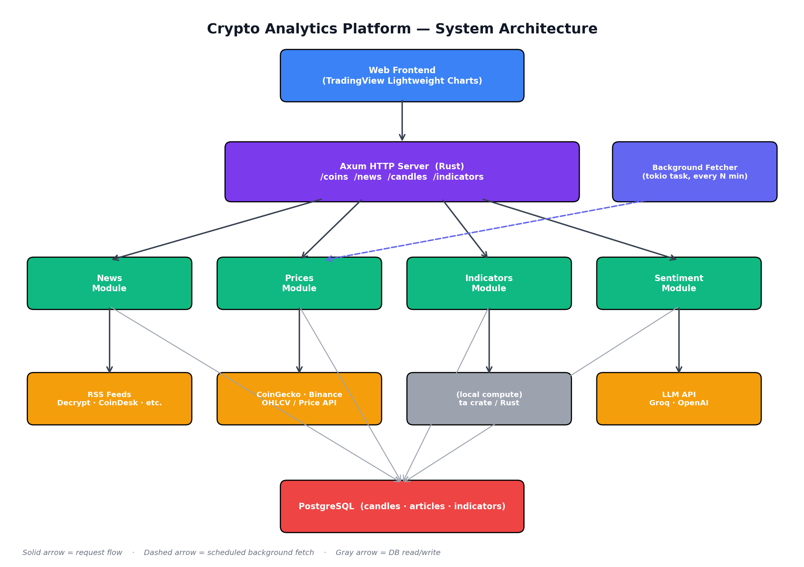

<div align="center">

# Sextant

**Navigation tools for crypto markets — read the signals, decide for yourself.**

_A thinking tool, not a prediction tool._


</div>

---

## Table of Contents

- [What is Sextant?](#what-is-sextant)
- [Why "Sextant"?](#why-sextant)
- [The honest position on predictions](#the-honest-position-on-predictions)
- [What Sextant actually does](#what-sextant-actually-does)
- [Architecture](#architecture)
- [Tech stack](#tech-stack)
- [Quick start](#quick-start)
- [Project structure](#project-structure)
- [API endpoints](#api-endpoints)
- [Database schema](#database-schema)
- [Roadmap](#roadmap)
- [Development guide](#development-guide)
- [Contributing](#contributing)
- [License](#license)
- [Disclaimer](#disclaimer)

---

## What is Sextant?

Sextant is an open, self-hostable **crypto market dashboard** that helps you understand
what's happening in the market — without pretending to know what happens next.

It aggregates news from major crypto sources, overlays news events on live price charts,
computes standard technical indicators (RSI, MACD, moving averages), and scores news
sentiment per coin. Everything is exposed as a clean HTTP API, so you can build any
frontend you want on top of it — or just query it from `curl`.

The core ethos is unusual for a crypto product: **no predictions.** No "AI predicts BTC
to $200k" features. No buy/sell signals dressed up as analysis. Just honest measurement
of what's happening, served fast and clean.

---

## Why "Sextant"?

A sextant is the navigation instrument sailors used for centuries to figure out where they
were on the open ocean. You point it at the sun, you read it, you do some math — and you
learn your position.

A sextant doesn't tell you where to go. It tells you where you are.

That's exactly the product. Sextant gives you instruments — price, indicators, news,
sentiment — and lets you do the navigation yourself. It's a tool for thinking, not a
shortcut around thinking.

---

## The honest position on predictions

Most "AI crypto" tools promise to predict price. We don't, and we won't. Why:

- **Markets at short timeframes are very close to a random walk.** Even professional quant
  funds with PhD teams and ₹100Cr+ in infrastructure barely outperform. A side project
  isn't going to crack this.
- **Most retail "AI prediction" tools are no better than a coin flip.** They look great in
  backtests because they're overfitted to historical data, then fail in live trading.
- **Anyone with a working prediction model wouldn't sell it.** They'd trade it privately
  and become a billionaire. If it's being sold to retail, that's a strong signal it
  doesn't work.
- **Shipping "predictions" is a liability.** If a user loses money following a prediction
  feature, that's real harm — and potential legal exposure for whoever shipped it.

So instead of pretending, Sextant ships what's _actually_ useful: tools that show you what's
happening, measured honestly, so you can decide for yourself.

---

## What Sextant actually does

| Feature                                     | What it is                                                                                                                | Why it's useful                                                                                   |
| ------------------------------------------- | ------------------------------------------------------------------------------------------------------------------------- | ------------------------------------------------------------------------------------------------- |
| **Aggregated news**                         | Pulls from Decrypt, CoinTelegraph, NewsBTC, CoinDesk in parallel, deduplicated and ranked.                                | One feed instead of four open tabs.                                                               |
| **News overlay on price chart**             | Annotates news events on the price chart at the time they were published.                                                 | Lets you see _"BTC dropped 3% right after this headline"_ — explains moves, doesn't predict them. |
| **Technical indicators**                    | RSI, MACD, moving averages, support/resistance — computed from stored OHLCV candles.                                      | Standard trader tools, not magic. Just math.                                                      |
| **News sentiment scoring**                  | Each article classified bullish / bearish / neutral per coin via a small LLM call. Rolls up to a 24-hour sentiment score. | A measurement of the news mood, not a prediction of where price goes.                             |
| **Historical pattern matching** _(planned)_ | "Current setup looks similar to N past setups. Of those, price went up X% / down Y% / sideways Z%."                       | Probabilistic and honest about uncertainty. Never deterministic.                                  |
| **Condition alerts** _(planned)_            | "BTC dropped below the 50-day MA" or "high-impact news detected for SOL."                                                 | Tells you the fact. You decide what to do.                                                        |

---

## Architecture



**Reading the diagram, top to bottom:**

1. **Web Frontend** — a single-page app using
   [TradingView Lightweight Charts](https://www.tradingview.com/lightweight-charts/) for
   price rendering. Talks to Sextant only over the HTTP API.
2. **Axum HTTP Server** — the Rust backend. Exposes endpoints under `/coins`, `/news`,
   `/candles`, `/indicators`. Stateless; all state lives in Postgres.
3. **Feature modules** — `news`, `prices`, `indicators`, `sentiment`. Each is a self-
   contained module with its own router, service, and (if needed) background fetcher.
   They're merged into the main router in `main.rs` via `.merge(<module>::router())`.
4. **External data sources** — RSS feeds for news, CoinGecko or Binance for price data,
   an LLM provider (Groq / OpenAI) for sentiment classification. The indicators module
   is pure local compute — no external dependency.
5. **Background fetcher** — a tokio task spawned at startup that polls the price APIs
   every N minutes and writes OHLCV candles to Postgres. This is what gives Sextant
   fast chart reads even when the upstream APIs are slow.
6. **PostgreSQL** — single source of truth for stored candles, fetched articles, computed
   indicator snapshots, and sentiment labels.

**Conventions in the diagram:**

- _Solid arrow_ = synchronous request flow (a client request triggers this).
- _Dashed arrow_ = scheduled background fetch (the system does this on its own).
- _Gray arrow_ = database read / write.

---

## Tech stack

| Layer            | Choice                           | Why                                                                |
| ---------------- | -------------------------------- | ------------------------------------------------------------------ |
| Language         | **Rust** (2024 edition)          | Fast, memory-safe, single-binary deploys, excellent async story.   |
| HTTP framework   | **axum 0.8**                     | Modern, minimal, built on `tokio` and `tower`. Composable routers. |
| Async runtime    | **tokio**                        | De facto standard. Powers all I/O.                                 |
| Database         | **PostgreSQL 16**                | Single source of truth. Rich SQL, time-series friendly.            |
| DB client        | **sqlx 0.8**                     | Async, compile-time checked queries. No ORM magic.                 |
| Migrations       | **`sqlx migrate`**               | Versioned SQL migrations, applied at startup.                      |
| HTTP client      | **reqwest**                      | Async, rustls TLS, no OpenSSL pain.                                |
| RSS parsing      | **feed-rs**                      | Handles RSS 2.0, Atom, JSON Feed in one API.                       |
| Auth             | **JWT + Argon2**                 | Stateless tokens, slow password hashing.                           |
| Observability    | **tracing + tracing-subscriber** | Structured logs, env-controllable filters.                         |
| Containerization | **Docker Compose**               | One command to bring up Postgres locally.                          |

The full dependency list lives in [`Cargo.toml`](./Cargo.toml).

---

## Quick start

### Prerequisites

- Rust toolchain (`rustup` from <https://rustup.rs>)
- Docker + Docker Compose
- `git`

### Run it locally

```bash
# 1. Clone
git clone https://github.com/<you>/sextant
cd sextant

# 2. Start Postgres in Docker
docker compose up -d

# 3. Configure environment
cp .env.example .env
# (defaults work out of the box for local dev)

# 4. Run the server
cargo run

# 5. Hit the health endpoint
curl -s http://localhost:3000/health | jq
```

You should see:

```json
{
  "status": "ok",
  "service": "sextant",
  "version": "0.1.0",
  "timestamp": "2026-05-15T...",
  "db": "connected"
}
```

### Try the news endpoint

```bash
curl -s "http://localhost:3000/news?q=bitcoin" | jq '.[0:3]'
```

### Try the price chart endpoint _(once `prices` module ships)_

```bash
curl -s "http://localhost:3000/coins/BTC/candles?interval=1h&limit=200" | jq '.[0]'
```

---

## Project structure

```
sextant/
├── Cargo.toml
├── docker-compose.yml
├── .env.example
├── README.md
├── architecture.png
├── migrations/                  -- sqlx migrations (versioned SQL files)
│   ├── 20260512_create_notes.sql
│   ├── 20260513_create_candles.sql
│   └── ...
└── src/
    ├── main.rs                  -- entry point: config, db pool, router assembly
    ├── config.rs                -- env-driven configuration
    ├── error.rs                 -- shared error type, HTTP mapping
    ├── state.rs                 -- AppState (db pool, config) shared across handlers
    ├── auth/                    -- JWT issuing + verifying, login/register
    ├── news/                    -- aggregated crypto news
    │   ├── mod.rs
    │   ├── handler.rs           -- GET /news
    │   ├── service.rs           -- fan-out fetch + filter
    │   └── sources.rs           -- RSS feed list
    ├── prices/                  -- OHLCV price feed (planned)
    │   ├── mod.rs
    │   ├── handler.rs           -- GET /coins, /coins/:symbol, /coins/:symbol/candles
    │   ├── service.rs           -- CoinGecko / Binance integration
    │   └── fetcher.rs           -- background tokio task
    ├── indicators/              -- RSI / MACD / MA (planned)
    │   ├── mod.rs
    │   └── service.rs
    └── sentiment/               -- per-article bullish/bearish/neutral (planned)
        ├── mod.rs
        └── service.rs
```

Each feature module exposes a `pub fn router() -> Router<AppState>` and is merged into
the top-level router in `main.rs`. Same pattern across the codebase — predictable to
navigate, predictable to extend.

---

## API endpoints

> All endpoints return JSON. Authenticated endpoints expect `Authorization: Bearer <jwt>`.

### Health

| Method | Path      | Description                        |
| ------ | --------- | ---------------------------------- |
| `GET`  | `/health` | Service + database liveness probe. |

### News

| Method | Path                  | Description                                          |
| ------ | --------------------- | ---------------------------------------------------- |
| `GET`  | `/news?q=<keyword>`   | Aggregated news across sources, filtered by keyword. |
| `GET`  | `/news?coin=<symbol>` | News filtered to a specific coin _(planned)_.        |

### Coins & prices _(planned)_

| Method | Path                                           | Description                                              |
| ------ | ---------------------------------------------- | -------------------------------------------------------- |
| `GET`  | `/coins`                                       | List of tracked coins with current price and 24h change. |
| `GET`  | `/coins/:symbol`                               | Coin detail: price, 24h change, market cap, sparkline.   |
| `GET`  | `/coins/:symbol/candles?interval=1h&limit=200` | OHLCV candles for charting.                              |
| `GET`  | `/coins/:symbol/indicators`                    | Current RSI, MACD, moving-average values.                |

### Auth

| Method | Path             | Description                           |
| ------ | ---------------- | ------------------------------------- |
| `POST` | `/auth/register` | Create a new account.                 |
| `POST` | `/auth/login`    | Exchange credentials for a JWT.       |
| `GET`  | `/auth/me`       | Get the authenticated user's profile. |

---

## Database schema

The two core tables (others added per-feature):

```sql
-- OHLCV price candles, one row per (coin, interval, timestamp).
CREATE TABLE candles (
    coin     TEXT        NOT NULL,
    interval TEXT        NOT NULL,   -- '1h', '4h', '1d'
    ts       TIMESTAMPTZ NOT NULL,
    open     NUMERIC     NOT NULL,
    high     NUMERIC     NOT NULL,
    low      NUMERIC     NOT NULL,
    close    NUMERIC     NOT NULL,
    volume   NUMERIC     NOT NULL,
    PRIMARY KEY (coin, interval, ts)
);

CREATE INDEX candles_coin_ts_idx ON candles (coin, ts DESC);

-- Articles fetched from RSS sources, deduplicated by link.
CREATE TABLE articles (
    id          UUID         PRIMARY KEY,
    source      TEXT         NOT NULL,
    title       TEXT         NOT NULL,
    link        TEXT         NOT NULL UNIQUE,
    snippet     TEXT,
    published   TIMESTAMPTZ,
    fetched_at  TIMESTAMPTZ  NOT NULL DEFAULT NOW(),
    sentiment   TEXT,        -- 'bullish' / 'bearish' / 'neutral' / NULL
    coins       TEXT[]       NOT NULL DEFAULT '{}'  -- tickers mentioned
);

CREATE INDEX articles_published_idx ON articles (published DESC);
CREATE INDEX articles_coins_idx ON articles USING GIN (coins);
```

Migrations are versioned in `migrations/` and applied at startup via
`sqlx::migrate!("./migrations").run(&db)` in `main.rs`.

---

## Roadmap

Ordered so each step builds on the previous. Don't skip ahead.

1. **Price feed + chart, one coin.** No predictions, no sentiment. Just BTC's chart plus
   its news. Validate that anyone wants this. _~1 week._
2. **Multi-coin support + home page.** Grid of coin tiles with current price and 24h
   change. _~3-4 days._
3. **Technical indicators sidebar.** RSI, MACD, moving averages computed from stored
   candles. _~2-3 days._
4. **News sentiment scoring.** First place an LLM call earns its keep — one call per
   article to classify bullish / bearish / neutral. _~4-5 days._
5. **Current-setup analysis.** Only after the above is being used by real people. Frame
   carefully as observation, never as advice.

**Explicitly out of scope, possibly forever:**

- Price predictions ("BTC will hit X by Y").
- Buy/sell signals.
- Auto-trading.
- Anything that takes financial action on a user's behalf.

The product is a thinking tool. Adding signals turns it into an oracle, which is the
exact thing we don't want to be.

---

## Development guide

### Adding a new feature module

Sextant uses a flat **feature module** layout. To add a new one (e.g., `alerts`):

1. Create `src/alerts/mod.rs`, `handler.rs`, `service.rs`.
2. Expose a `pub fn router() -> Router<AppState>` from `mod.rs`.
3. Register it in `src/main.rs`:
   ```rust
   mod alerts;
   // ...
   let app = Router::new()
       .route("/health", get(health))
       .merge(auth::router())
       .merge(news::router())
       .merge(alerts::router())   // <-- new
       .with_state(state);
   ```
4. Add migrations under `migrations/` if the feature needs new tables.

### Adding a migration

```bash
cargo install sqlx-cli --no-default-features --features postgres
sqlx migrate add <name>       # creates migrations/<timestamp>_<name>.sql
# edit the new file, then either restart the server (auto-applies)
# or run manually:
sqlx migrate run
```

### Running tests

```bash
cargo test
```

### Linting

```bash
cargo fmt --check
cargo clippy -- -D warnings
```

### Useful Docker commands

```bash
docker compose logs -f postgres                                  # tail Postgres logs
docker compose down                                              # stop services
docker compose down -v                                           # stop + wipe data
docker exec -it sextant-pg psql -U sextant -d sextant            # psql shell
```

---

## Contributing

Sextant is a personal project and contributions are welcome, but **please open an issue
before sending a PR** — especially for anything that touches the prediction-vs-analysis
line. The product position is opinionated by design.

Things that are easy yeses to merge:

- New news source integrations (RSS feeds for niches we don't cover).
- More indicator implementations.
- Bug fixes, perf improvements, better tests.
- Docs improvements.

Things that need discussion first:

- Anything that produces a buy/sell signal.
- Anything that auto-trades.
- New external dependencies.

---

## License

[MIT](./LICENSE) — do whatever you want, just don't sue me. See `LICENSE` for the
full text.

---

## Disclaimer

**Sextant is not financial advice.** It is an analysis tool that aggregates publicly
available information and computes standard technical indicators. Nothing it outputs
constitutes investment advice, a recommendation to buy or sell any asset, or a guarantee
of future market behaviour. Cryptocurrencies are volatile and risky; you can lose money.
Always do your own research, and consider talking to a SEBI-registered financial advisor
before making investment decisions.

This project is provided as-is, without warranty of any kind. The author is not liable
for any losses incurred by anyone using this software or any output it produces.

---

<div align="center">

_Sextant doesn't tell you where the market is going.<br>It tells you where it is._

</div>
